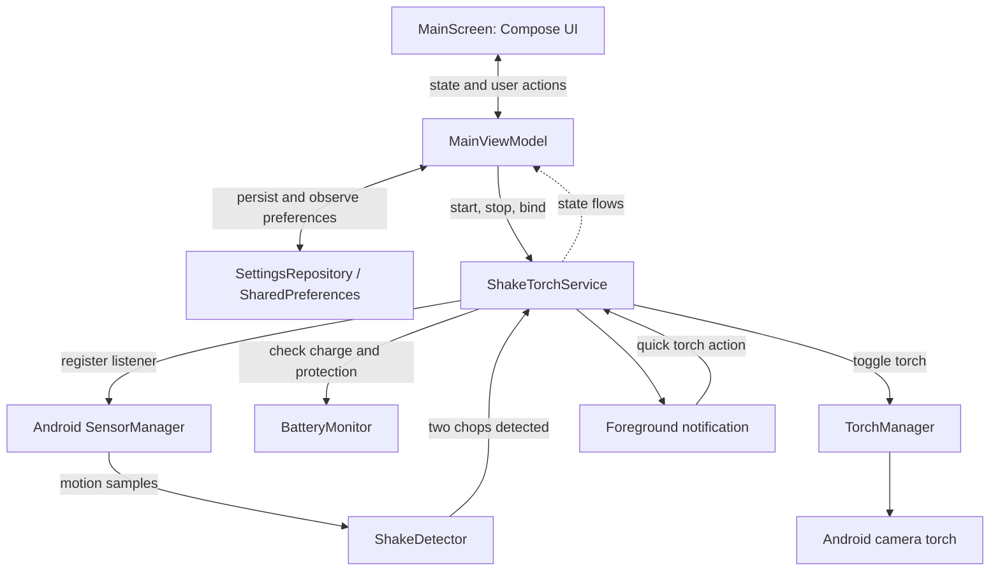

# ShakeTorch

<p align="center">
	
</p>

<p align="center"><strong>Two chops. One light.</strong><br>Turn your Android phone's camera flash on or off with a deliberate double-chop gesture.</p>

<!-- Optional banner: add docs/images/shaketorch-banner.png and place it above the app icon. -->

<p align="center">
	<a href="https://github.com/uzaifahmad/ShakeTorch/actions"></a>
	
	
	<a href="https://github.com/uzaifahmad/ShakeTorch/stargazers"></a>
</p>

<p align="center">
	
	
	
</p>

> **Project status:** ShakeTorch is an Android project. There is no hosted demo, CI workflow, or `LICENSE` file yet. The build and license badges above are placeholders; see [Contributing](#contributing-and-community) before reusing or distributing this code.

> **Download:** Get the latest installable APK from [GitHub Releases](https://github.com/uzaifahmad/ShakeTorch/releases/latest). The v1.0.0 APK is debug-signed for this initial community release; it is not a Play Store build.

## Contents

- [Features](#features)
- [Preview](#preview)
- [Download](#download)
- [Project structure](#project-structure)
- [Getting started](#getting-started)
- [Architecture](#architecture)
- [Roadmap](#roadmap)
- [Contributing and community](#contributing-and-community)

## Features

ShakeTorch is a native Android flashlight app for people who want a quick, screen-independent way to control their phone's rear flash. Tap the on-screen control for manual use, or enable gesture mode to listen for two deliberate chopping motions.

- 🔦 **Manual flashlight control:** Toggle the camera flash directly from the home screen.
- 🫨 **Double-chop gesture:** A filtered, two-peak detector looks for two distinct motions with a recoil between them.
- 📱 **Background listening:** An Android foreground service can listen while the Activity is closed or the screen is locked, subject to device and OS power limits.
- 🎚️ **Adjustable sensitivity:** Choose Easier, Balanced, or Deliberate detection.
- 🔋 **Battery protection:** Optionally block gestures below 15% battery; the torch is switched off when protection activates.
- 📳 **Haptic feedback:** Toggle vibration after a detected gesture.
- 🔔 **Notification controls:** See listening status and use a quick torch action from the foreground-service notification.
- 🎨 **Code-drawn interface:** A monochrome Compose screen uses custom Canvas artwork and animation; no remote images or animation assets are downloaded.
- 💾 **Saved preferences:** Gesture mode, sensitivity, battery protection, and vibration settings persist locally.

## Preview

There is no hosted demo because ShakeTorch is a native Android app. This small mock shows the main controls; the actual screen also includes animated artwork and expandable settings.

```text
┌─────────────────────────────────────────┐
│ SHAKE / TORCH                    SETTINGS│
│                                         │
│                   ( O )                 │
│                 LIGHT OFF               │
│          Tap the circle to switch on    │
│                                         │
│ ─────────────────────────────────────── │
│ SHAKE GESTURE              [   OFF   ]  │
│ Two chops. One light.                   │
└─────────────────────────────────────────┘
```

To try it, [build and install the debug app](#getting-started) on an Android phone. For implementation details, open the [main Compose screen](app/src/main/java/com/shaketorch/app/ui/MainScreen.kt).

## Download

Download the APK attached to the [latest GitHub Release](https://github.com/uzaifahmad/ShakeTorch/releases/latest) and install it on an Android 8.0 (API 26) or newer device. You may need to allow installs from your browser or file manager. The initial v1.0.0 APK uses Android's debug signing key so it can be installed directly; it is not signed with a production release key or intended for Play Store distribution. For future updates, install APKs from the same signing key. If a signature conflict occurs, uninstall the existing app first; this removes its local app data.

## Project structure

```text
.
├── app/
│   ├── build.gradle.kts                 # Android app, SDK levels, and dependencies
│   └── src/main/
│       ├── AndroidManifest.xml           # Components, hardware features, and permissions
│       ├── java/com/shaketorch/app/
│       │   ├── MainActivity.kt           # Activity and Compose entry point
│       │   ├── ShakeTorchApplication.kt  # Application setup
│       │   ├── model/Sensitivity.kt      # Gesture sensitivity choices
│       │   ├── receiver/BootReceiver.kt  # Best-effort service restoration
│       │   ├── repository/               # Persistent user preferences
│       │   ├── service/                  # Sensor detection, torch, battery, foreground service
│       │   ├── theme/                    # Compose theme, colors, and typography
│       │   └── ui/                       # Main screen and UI state holder
│       └── res/                          # Launcher icons, strings, themes, and backup rules
├── gradle/
│   ├── libs.versions.toml                # Dependency and plugin versions
│   └── wrapper/                          # Gradle wrapper configuration
├── gradlew                               # Gradle wrapper for macOS/Linux
├── gradlew.bat                           # Gradle wrapper for Windows
└── settings.gradle.kts                   # Gradle project configuration
```

## Getting started

### Prerequisites

| Requirement | Details |
| --- | --- |
| JDK | 17 or newer |
| Android SDK | Platform 36 and Android SDK Build Tools; Android Studio can install these |
| Android device | Android 8.0 (API 26) or newer with an accelerometer; a camera flash is needed for the flashlight |
| Optional tools | `adb` and USB debugging for command-line installation |

### Install and build

1. Clone the repository and open its directory:

	 ```sh
	 git clone https://github.com/uzaifahmad/ShakeTorch.git
	 cd ShakeTorch
	 ```

2. Build the debug APK with the Gradle wrapper.

	 **Windows PowerShell:**

	 ```powershell
	 .\gradlew.bat :app:assembleDebug
	 ```

	 **macOS or Linux:**

	 ```sh
	 ./gradlew :app:assembleDebug
	 ```

3. Install on a connected device with USB debugging enabled, or launch the app from Android Studio:

	 ```sh
	 adb install -r app/build/outputs/apk/debug/app-debug.apk
	 ```

Gradle downloads its distribution and dependencies on the first build. The APK is written to `app/build/outputs/apk/debug/app-debug.apk`.

### Environment variables

No `.env` file or project-specific environment variables are required. Keep machine-specific Android SDK settings in the local Android environment; do not commit credentials or local configuration.

### Try gesture mode

1. Open the app and switch on **Shake Gesture**.
2. Hold the phone securely and make two distinct chopping motions with a brief recoil between them.
3. Lock the screen and try again. If detection is unreliable, adjust **Sensitivity** or review the app's battery settings.

On Android 13 and newer, notification permission allows the service notification to appear. Gesture mode can still run if notification permission is declined, but its status and quick action will not be visible there. Android power management varies by device and may limit background sensor delivery; lock-screen detection is best effort, not guaranteed.

## Architecture

The Compose UI observes state from `MainViewModel`. The view model coordinates direct torch control, persisted preferences, and starting or binding to `ShakeTorchService`. The service registers an accelerometer (or linear-acceleration sensor when available), passes samples to `ShakeDetector`, and toggles the camera torch through `TorchManager` when a gesture is recognized. Battery monitoring can block the toggle at low charge when protection is enabled. State flows carry service and torch status back to the UI.



**Platform limits:** Android vendors can throttle sensor delivery or stop background work, especially during deep sleep. Reboot restoration is best effort. The camera flash may be unavailable if the device has no flash, another app is using the camera, or the system applies thermal or power restrictions. The service uses Android's `specialUse` foreground-service type; review current Play policy requirements before distribution.

## Roadmap

- [x] Manual camera-flash toggle
- [x] Foreground service for gesture listening and notification actions
- [x] Adjustable double-chop sensitivity and persistent preferences
- [x] Battery protection and optional haptic feedback
- [x] Publish the initial v1.0.0 APK on GitHub Releases
- [ ] Add screenshots or a short device-recorded demo to the repository
- [ ] Add automated tests for gesture detection and settings behavior
- [ ] Add a CI workflow to build and verify pull requests
- [ ] Publish a tagged release with installation notes

Have a useful addition in mind? Open an issue to discuss it or send a pull request.

## Contributing and community

Contributions are welcome, including bug reports, device-compatibility notes, documentation improvements, and focused code changes. Before opening a pull request, build the debug app with the commands above and describe the device and Android version for any sensor or background behavior change.

- **Issues:** [Report a bug or suggest an improvement](https://github.com/uzaifahmad/ShakeTorch/issues)
- **Pull requests:** [Open a pull request](https://github.com/uzaifahmad/ShakeTorch/pulls)
- **Contribution guide:** [CONTRIBUTING.md](CONTRIBUTING.md) (planned; this file has not been added yet)
- **License:** This repository does not currently include a `LICENSE` file. No license is implied; check with the project owner before redistributing or incorporating the code.

### Contributors

[](https://github.com/uzaifahmad/ShakeTorch/graphs/contributors)

[](https://github.com/uzaifahmad/ShakeTorch/graphs/contributors)
